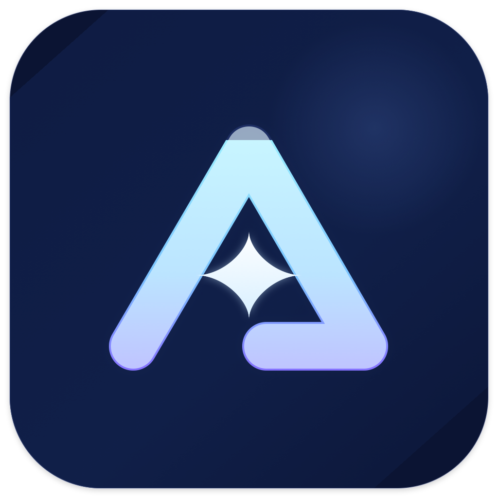
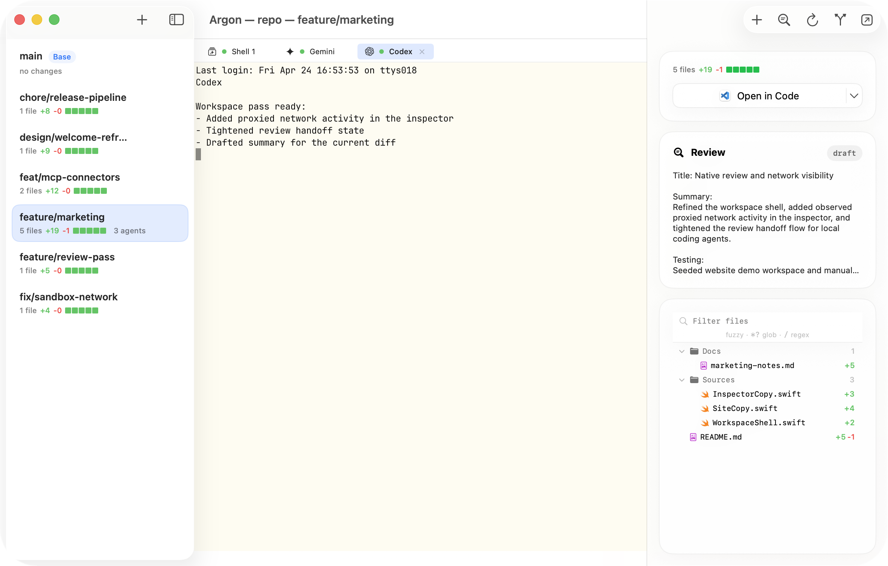
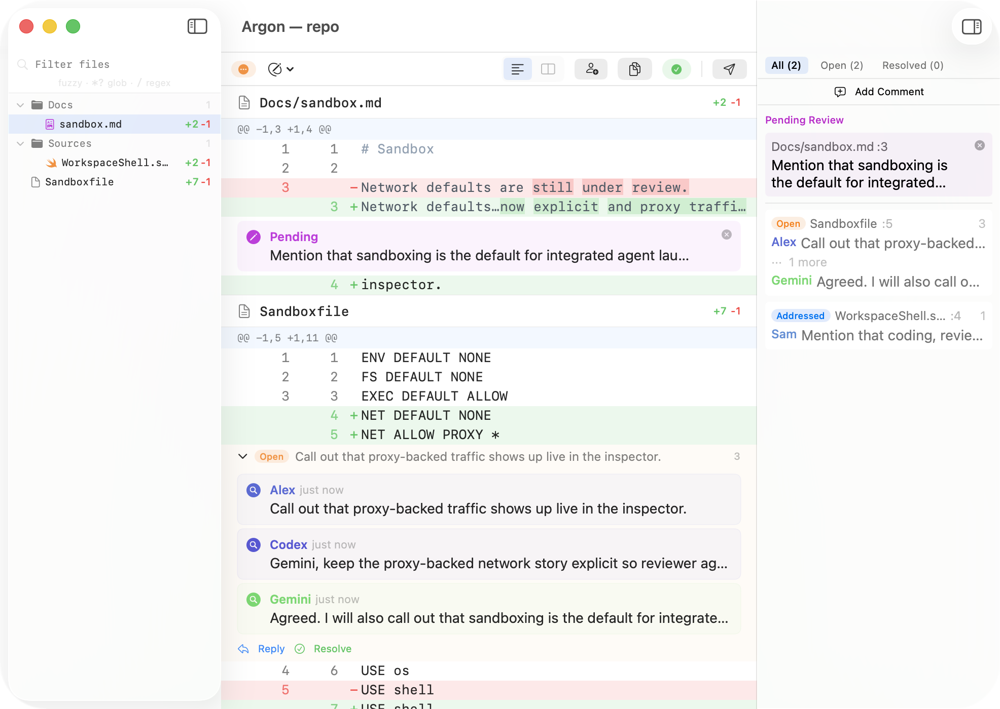

# Argon

<p align="center">
  
</p>

Argon is a local workspace for coding agents. It gives agent-assisted
development a home: isolated worktrees, terminals tied to branches, diffs ready
for review, and sandboxed runs you can inspect.

Website: [argonapp.dev](https://argonapp.dev)

## Install

Install the latest release with Homebrew:

```bash
brew install --cask fiam/tap/argon
```

You can also download the latest DMG or ZIP from
[GitHub Releases](https://github.com/fiam/argon/releases/latest).

Argon is currently macOS-only.

## Why Argon

Coding agents are useful, but the workflow around them gets scattered quickly:
temporary worktrees, terminal tabs, changed files, reviewer notes, sandbox
policy, network activity, and merge decisions all drift into different places.

Argon turns that local loop into one focused workspace:

- isolate each agent attempt in a real Git worktree
- run shells and coding agents in tabs tied to the selected branch
- keep changed files, review state, sandbox state, and network activity visible
- review before merge with draft comments, requested changes, approvals, and
  closed states
- bring another agent into review for a second pass
- launch integrated agents inside project-defined sandbox guardrails
- merge back or open a pull request from the same workspace
- drive the same workflow from the bundled `argon` CLI when an agent needs a
  machine-readable interface

## Core Workflow

Open a repository:

```bash
argon <dir>
```

Open the review window directly:

```bash
argon review <dir>
```

The app can install or repair the bundled `argon` command line tool on first
launch. Agent workflows can also use `argon agent ...` commands for structured,
non-interactive review handoff.

## Screenshots

### Workspace



### Agent Review



## What Argon Gives You

### Organized Agent Attempts

Each repository gets a workspace window. Worktrees live in the sidebar, terminal
tabs stay attached to the selected branch, and changed files remain visible
while the agent is running.

### Review You Can Trust

A finished terminal only means the agent stopped. Argon adds the review layer
that makes the result understandable, discussable, and safe to approve. Draft
comments stay draft until submitted, approvals and requested changes are
explicit, and reviewer-agent feedback stays tied to stable comment threads.

### Sandboxed Runs

Integrated shell and agent launches can run with project-defined policy for file
access, process execution, environment, and network access. Project policy lives
in `Sandboxfile`, and proxy-backed network activity can be inspected from the
app.

See [SANDBOX.md](SANDBOX.md) for the policy format and current macOS behavior.

## Docs

- [Sandbox reference](SANDBOX.md)
- [Development and contributing](docs/development.md)
- [Architecture and repo layout](docs/architecture.md)
- [Ghostty integration notes](docs/ghostty-integration.md)
- [Product requirements](PRD.md)

## Hacking On Argon

If you want to build, test, or contribute to Argon, start with
[docs/development.md](docs/development.md). It covers local setup, Ghostty
prerequisites, build commands, checks, and contribution rules.
