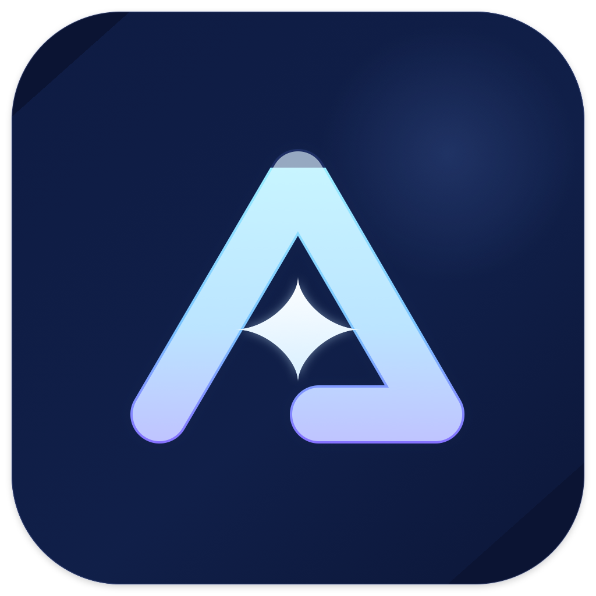
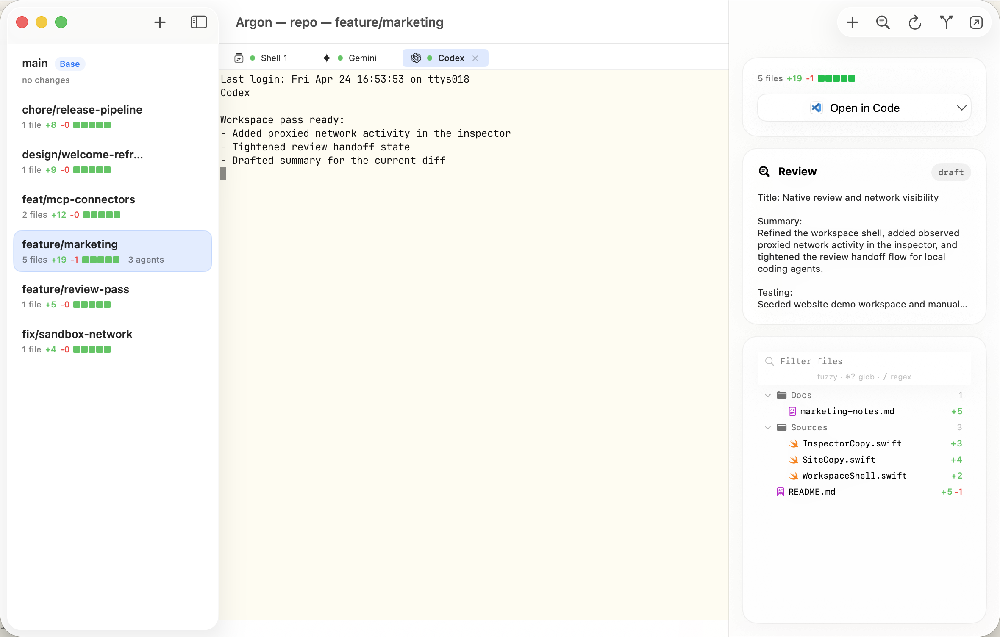
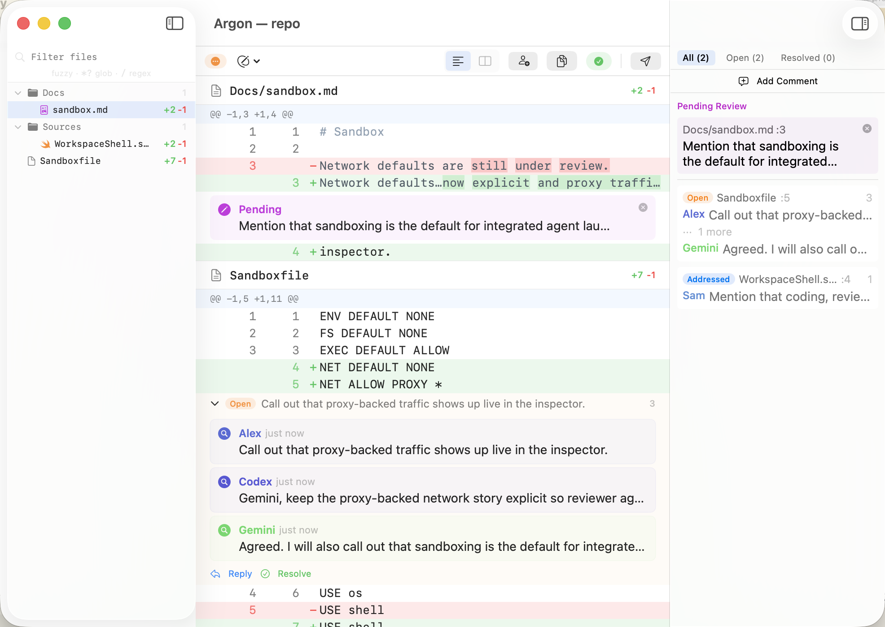

# Argon

<p align="center">
  
</p>

Argon is a native macOS workspace for coding agents.

It gives you one place to:

- open the right repository or worktree from Terminal with `argon <dir>`
- manage linked worktrees without juggling clone directories by hand
- run shells and coding agents in embedded terminal tabs
- review changes before they land, with explicit draft, approval, and
  requested-changes states
- ask other agents to review the branch before merge-back
- launch agent work inside a local sandbox that is enabled by default
- merge back or open a pull request from the same workspace

Argon is currently macOS-only.

## Core Commands

Once the app is installed, Argon can install or repair the bundled
`argon` command line tool for you on first launch.

The main entry points are:

```bash
argon <dir>
argon review <dir>
```

- `argon <dir>` opens the workspace window for the repository containing
  `<dir>`
- `argon review <dir>` opens the standalone review window for the
  repository containing `<dir>`

Argon also supports machine-readable review workflows through
`argon agent ...` commands, so agents can participate in the same formal
review loop without requiring a skill installation.

## Screenshots

### Workspace



### Review



## How Argon Works

### Worktree-Native Workspace

Each repository gets one workspace window. Inside it you can:

- switch between worktrees from a single sidebar
- keep shell tabs and agent tabs tied to the selected worktree
- inspect diff summary, review state, and changed files from the same
  window

### Formal Review Before Merge

Argon keeps review explicit and visible:

- draft comments stay draft until submitted
- approvals and requested changes are formal states
- human reviewers stay in control of the final decision
- reviewer agents can comment and request changes before the branch lands

### Sandboxed Agent Launch

Sandboxing is on by default for sandboxed agent and shell launches.

The current macOS sandbox supports:

- filesystem write restrictions
- executable policy
- environment filtering
- command interception
- direct network rules and proxy-backed host rules

See [SANDBOX.md](SANDBOX.md) for the exact policy format and current
macOS behavior.

## Docs

- [Sandbox reference](SANDBOX.md)
- [Development and contributing](docs/development.md)
- [Architecture and repo layout](docs/architecture.md)
- [Ghostty integration notes](docs/ghostty-integration.md)
- [Product requirements](PRD.md)

## Hacking On Argon

If you want to build, test, or contribute to Argon, start here:

- [docs/development.md](docs/development.md)

That document covers local setup, Ghostty prerequisites, build commands,
checks, and contribution rules.
